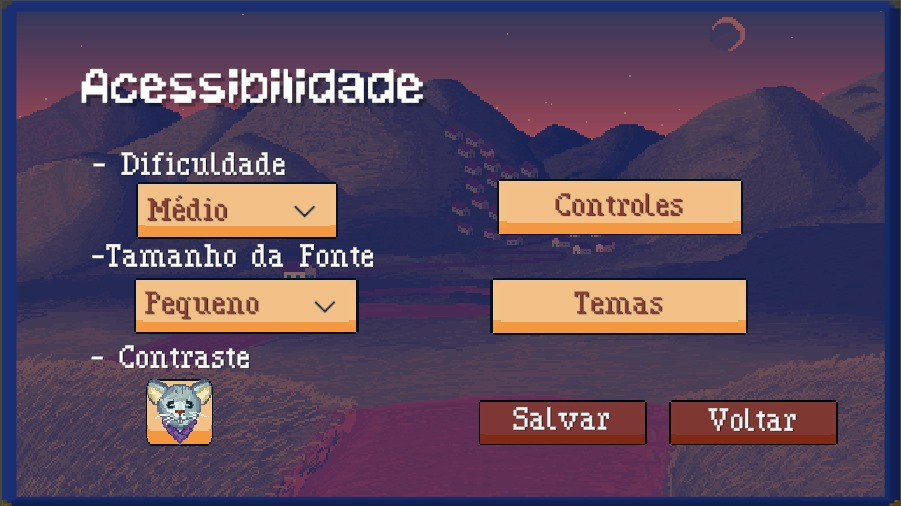

# 2024-303-RATO
<!-- # 2024-303-RATO-->

<h1> R.A.T.O.</h1>

<p align="left">Um jogo desenvolvido pelos integrantes Marco Túlio, Bruna Santarelli, Isabel Valadares e Joana Guimarães</p>

## Ideia Principal

<p> Neste jogo você está na pele de um rato que se torna consciente após se alimentar de um astrônomo chamado Carlos Porto. Com isso, você se encontra agora na profundidade das emoções, pensamentos e reflexões da vida cotidiana que agora é vista com outros olhos, explorando o que seria a fronteira entre o que é ser animal e o que é ser humano. Enquanto você avança, é exposto à complexidade da sociedade e suas injustiças, enquanto se questiona se não seria mais fácil voltar a selvageria, afinal, ainda há volta? <br> Resumindo, é a história de um rato enquanto ele lida com confrontos internos entre a ascensão à humanidade ou à selvageria,fazendo uma abordagem mais reflexiva sobre a profundidade da consciência e do que nos difere dos animais.</p>

### Especificações Gerais

- **Gênero:** Terror Psicológico / Visual Novel;
- **Interface:** Pixel 2D plataforma;
- **Progressão de história:** Linear;
- **Três episódios curtos**
- **Público alvo:** pessoas que gostam de jogos de quase terror ;
- **Plataforma:** Pc;


###  MENU

### Tela Inicial

<p align="center"></p>

- **Jogar**  Carrega um novo jogo ou continua de onde parou;
- **Acessibilidade** Mais detalhes abaixo;
- **Configurações** Abre as configurações da jogatina;
- **Créditos** Abre os créditos do jogo;

### Início da jornada

<p align="center"></p>

- **Novo Jogo:** Cria um novo save;
- **Continuar:** Continua o game de onde o jogador parou;

### Configurações

<p align="center"></p>

- **Audio:** Permite desabilitar ou ajustar o volume dos audios gerais do jogo;
- **Música** Permite desabilitar ou ajustar o volume da música;
- **Tela cheia/ajustável** Escolhe um dos dois tipos de tela;

### Acessibilidade

<p align="center"></p>

- **Dificuldade** Ajusta a dificuldade do jogo, podendo ser fácil, médio ou difícil;
- **Tamanho da Fonte** Escolha entre os diferentes tamanhos de fonte para uma melhor visibilidade;
- **Controles** Permite remapear as teclas;
- **Temas** O jogador pode escolher o tema da legenda;
- **Contraste de Cores** Aplica um filtro ao jogo que deixa as cores mais distoantes entre si, deixando mais fácil de distinguir objetos clicáveis e não clicáveis no jogo;

### Temas de legenda

<p align="center"></p>

 <p> Há três modos de legendas que o jogador pode escolher para o jogo. </p>

### Controles

<p align="center"></p>
<p>Todas as teclas podem ser remapeadas, permitindo que o usuário personalize cada comando com a tecla de sua preferência.</p>

### Créditos
- Ainda não foi feito

## Conclusão

<p> Este jogo foi feito pelos alunos  Marco Túlio, Bruna Santarelli, Isabel Valadares e Joana Guimarães, agradeçemos a todos pela atenção ao projeto, pois ele foi feito com muita dedicação, nos demandou muito tempo, discussões, risadas, tristezas, mas que no fim valeu a pena. Esperamos que possamos proporcional uma imersão intrigante aos usuários, uma história impactante de alguma forma e que essa jornada tenha sida única para cada um dos jogadores, pois cada um compartilha de pensamentos, reflexões e experiências distintas, por isso, esteja a vontade para interpretar como quiser e não deixe de expor suas ideias!</p>

<p align="center">Divirta-se e boa sorte!</p>
```
